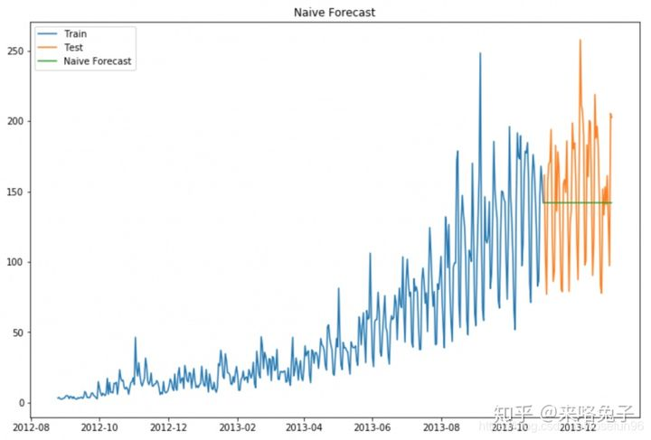
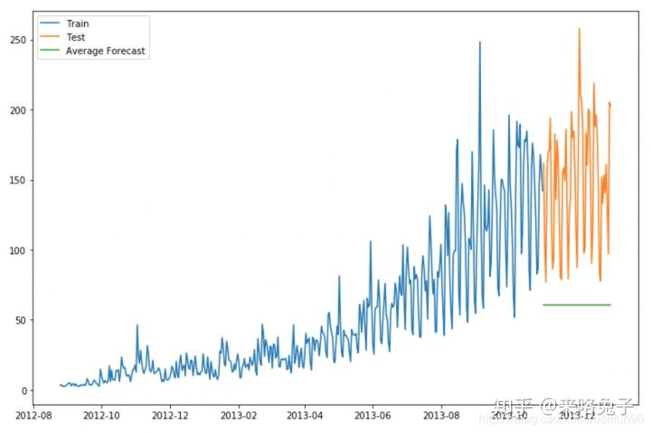
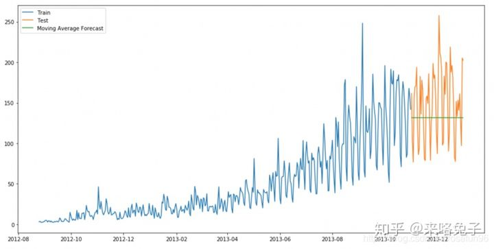

# 時間序列模型

- 重視資料的先後順序
- 觀測值之間彼此不獨立
- 不關注變量間的因果關係，而是變量在時間上的發展變化規律

## 應用面向

預測金融股市、人力安排等等

## 預測方法

### 樸素估計

使用最後一個時間點的值估測後面一段時間的值
$$
\hat y_{t+1} = y_t
$$


### 簡單平均

用歷史的均值來估測後面一段時間的值
$$
\hat y_{x+1} = \frac{1}{x} \sum_i^x y_i
$$



### 移動平均

使用之前一定時間段的平均值作為這個時間點的值，或使用加權的移動平均

- 之前一段時間的平均
  $$
  \hat y_i = \frac{1}{p}(y_{i-1}+y_{i-2}+y_{i-3}+......+y_{i-p})
  $$

- 移動加權平均
  $$
  \hat y_i = \frac{1}{m}(w_1*y_{i-1}+w_2*y_{i-2}+w_3*y_{i-3}+...+w_m*y_{i-m})
  $$



### 簡單指數平滑

```python
from statsmodels.tsa.api import ExponentialSmoothing, SimpleExpSmoothing, Holt
y_hat_avg = test.copy()
fit2 = SimpleExpSmoothing(np.asarray(train['Count'])).fit(
smoothing_level=0.6,optimized=False)
y_hat_avg['SES'] = fit2.forecast(len(test))
```

### Holt's線性趨勢方法

```python
import statsmodels.api as sm
sm.tsa.seasonal_decompose(train.Count).plot()
result = sm.tsa.stattools.adfuller(train.Count)
```

### Holt-winters 方法

```python
y_hat_avg = test.copy()
fit1 = ExponentialSmoothing(np.asarray(train['Count']) ,
seasonal_periods=7 ,trend='add', seasonal='add',).fit()
y_hat_avg['Holt_Winter'] = fit1.forecast(len(test))
```

### Arima

ARIMA模型（Autoregressive Integrated Moving Average model）整合移動平均自回歸模型

ARIMA(p, d, q)由3個部分組成

- AR(p)：AR是autoregressive的縮寫，表示自回歸模型，含義是當前時間點的值等於過去若干個時間點的值的回歸——因為不依賴於別的解釋變量，只依賴於自己過去的歷史值，故稱為**自回歸**；如果依賴過去最近的p個歷史值，稱**階數**為p，記為`AR(p)`模型。
- I(d)：I是integrated的縮寫，含義是模型對時間序列進行了差分；因為時間序列分析要求平穩性，不平穩的序列需要通過一定手段轉化為平穩序列，一般採用的手段是差分；d表示**差分的階數**，t時刻的值減去t-1時刻的值，得到新的時間序列稱為1階差分序列；1階差分序列的1階差分序列稱為2階差分序列，以此類推；另外，還有一種特殊的差分是季節性差分S，即一些時間序列反應出一定的周期T，讓t時刻的值減去tT時刻的值得到季節性差分序列。
- MA(q)：MA是moving average的縮寫，表示移動平均模型，含義是當前時間點的值等於過去若干個時間點的**預測誤差**的回歸；**預測誤差=模型預測值-真實值**；如果序列依賴過去最近的q個歷史預測誤差值，稱階數為q，記為`MA(q)`模型。

```python
y_hat_avg = test.copy()
fit1 = sm.tsa.statespace.SARIMAX(train.Count, order=(2, 1, 
4),seasonal_order=(0,1,1,7)).fit()
y_hat_avg['SARIMA'] = fit1.predict(start="2013-11-1", 
end="2013-12-31", dynamic=True)
```

- Ref
  - [ARIMA模型详解](https://danzhuibing.github.io/ml_arima_basic.html)
  - [7 methods to perform Time Series forecasting (with Python codes)](https://www.analyticsvidhya.com/blog/2018/02/time-series-forecasting-methods/)
  - [利用Auto ARIMA构建高性能时间序列模型（附Python和R代码）](https://zhuanlan.zhihu.com/p/49746642)

### Prophet套件

- Facebook提出的一種方法，與Holt-winters類似，主要想法是" 時間序列的分解（Decomposition of Time Series），它把時間序列分成幾個部分，分別是季節項，趨勢項，剩餘項，與Holt -winters方法類似。
  
- 在Prophet算法裡面，作者同時考慮了季節項、趨勢項、節假日項與剩餘項
  $$
  y(t) = g(t) + s(t) + h(t) + \varepsilon_t
  $$

  - $g(t)$ 表示趨勢項，他表示時間序列在非週期上面的變化趨勢
  - $s(t)$ 表示週期項，或稱為季節項，一般來說是以周或者年為單位
  - $h(t)$ 表示節假日項，表示在當天是否存在節假日
  - $\varepsilon_t$ 表示誤差項或者稱為剩餘項

- Prophet 的算法就是通過擬合這幾個項，然後把他們累加起來得到時間序列的預測值

#### 趨勢項$g(t)$

#### 季節性趨勢

#### 節假日效應

- 在現實環境中，除了週末同樣有很多節假日，而且不同的國家有著不同的假期。在 Prophet 裡面，通過維基百科裡面對各個國家的節假日描述，hdays 收集了各個國家的特殊節假日。除了節假日之外，使用者還可以根據自身的情況來設置必要的假期，例如雙十一網購節、年終大促等等。

- 由於每個節假日對時間序列的影響程度不一樣，例如春節，國慶日則是七天假期。對於勞動節等假期來說則假日較短。因此不同的節假日可以看成相互獨立的模型，並且可以為不同的節假日設置不同的前後窗口值，表示該節假日會影響前後一段時間的時間序列。
- 用數學的語言來說，與第 $i$ 個節假日來說 $D_i$ 表示該節假日的前後一段時間。為了表示節假日效應，我們需要一個相應的指示函數(indicator function)，同時需要一個參數 $k_i$ 來表示節假日的影響範圍。


#### 模型擬合(Model Fitting)

在 Prophet 中，用戶一般可以設置以下四種參數，如果不想設置的話，使用 Prophet 默認的參數即可

1. Capacity: 在增量函數為邏輯回歸時需要設置的容量值。

2. Change Points: 通過 n_changepoints 和 changepoint_range 來進行等距的變點設置，也可以通過人工設置的方式來指定時間序列的變點

3. 季節性與節假日: 可以根據實際的業務需求來指定相應的節假日

4. 光滑參數: 

   - $\tau = $ changepoint_prior_scale 可以用來控制趨勢的靈活度
   - $\sigma = $ seasonality_prior_scale 用來控制季節項的靈活度
   - $v=$ holidays prior scale 用來控制節假日的靈活度

   


- Ref
  - [Classical Time Series Forecasting Methods in Python (Cheat Sheet)](https://machinelearningmastery.com/time-series-forecasting-methods-in-python-cheat-sheet/)
  - [FACEBOOK 时间序列预测算法 PROPHET 的研究](https://zr9558.com/2018/11/30/timeseriespredictionfbprophet/)
  - [11 Classical Time Series Forecasting Methods in Python (Cheat Sheet)](https://machinelearningmastery.com/time-series-forecasting-methods-in-python-cheat-sheet/)
  - [ARIMA——從案列出發，讓你徹底懂得時間序列模型](https://www.twblogs.net/a/5b8318ed2b717766a1eb09fd)
  - [TIME SERIES FORECAST AND DECOMPOSITION – 101 GUIDE PYTHON](https://datasciencebeginners.com/2020/11/25/time-series-forecast-and-decomposition-101-guide-python/)
  - [预测： 方法与实践](https://otexts.com/fppcn/index.html)
  - [How to Convert a Time Series to a Supervised Learning Problem in Python](https://machinelearningmastery.com/convert-time-series-supervised-learning-problem-python/)
  - [利用python进行时间序列分析——数据挖掘](https://zhuanlan.zhihu.com/p/35128342)

- 方法介紹
- 使用方式
- 成效
- 缺點/限制
- 